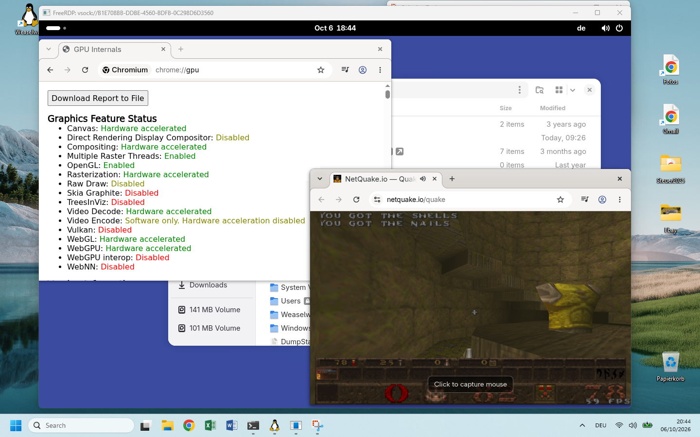

# Weaselway

[](https://github.com/weaselway/weaselway/releases)
[](https://github.com/weaselway/weaselway/actions/workflows/build-image.yml)
[](LICENSE)
[](https://discord.gg/6HG8ac8XWZ)

Weaselway runs a GPU-accelerated Linux desktop on WSL2 and shows it in a
window on Windows. It is distributed as a NixOS-WSL image.

https://github.com/user-attachments/assets/421018ab-684a-4c09-afc2-350e0ffb5089

The compositor runs unmodified. The `dxgdrm` kernel module provides a virtual
display that it drives like a monitor, and Mesa's `d3d12` driver renders on the
GPU that Windows exposes to WSL. The `weaselwayd` daemon reads each finished
frame and passes it through shared memory to a FreeRDP-based viewer on Windows.
Keyboard, mouse, touchpad and audio travel over the same connection.

Any Wayland compositor with a KMS backend can run this way. The image includes
GNOME, Plasma is a single option away, and sway, Weston, Hyprland and others
start through a session script you provide. See [Sessions](#sessions).

The image contains the patched Mesa, the kernel module, weaselwayd, the audio
configuration and the Windows viewer. The only separate download is a minimal
WSLg system distro ([weaselway/wslg](https://github.com/weaselway/wslg)): WSL
creates the shared memory region used for the frames only when a system distro
is configured.

[ARCHITECTURE.md](ARCHITECTURE.md) describes the architecture, the build and
how to debug it. Known [limitations](#limitations) are listed below the
installation instructions.

- [Requirements](#requirements)
- [Installation](#installation)
- [Limitations](#limitations)
- [Sessions](#sessions)
- [The viewer](#the-viewer)
- [Configuration](#configuration)
- [Updating](#updating)
- [Troubleshooting](#troubleshooting)

## Requirements

- Windows with WSL2, on an x86_64 machine. The image is x86_64 only.
- A GPU with a Windows driver that supports WSL GPU compute (the same driver
  that provides GPU access to other WSL distros).
- One of the WSL kernels `6.18.33.2-microsoft-standard-WSL2` (WSL 2.7) or
  `6.18.40.1-microsoft-standard-WSL2` (WSL 3.0). The `dxgdrm` module is built
  for these kernel releases, and another release cannot load it.
  Check yours with `uname -r` inside any WSL distro, and see
  [Limitations](#limitations) for what happens when WSL updates its kernel.
- About 1.4 GiB of disk space for the image, plus the system distro VHD.

<!-- TODO(maintainer): add the minimum Windows build and WSL version that have
     been tested (the output of `wsl --version`), and a rough RAM figure. -->

## Installation

In short, in PowerShell:

```powershell
wsl --install --from-file nixos-weaselway-<version>.wsl --name Weaselway
wsl -d Weaselway ww-install-system-image   # then edit .wslconfig, see step 3
wsl --shutdown
wsl -d Weaselway                           # Weaselway must be the first distro
```

then `ww-start-session` and `ww-start-viewer` inside the distro. The steps
below explain each of them.

<video src="doc/install.mp4" controls muted width="720"></video>

### 1. Get the image

Download `nixos-weaselway-<version>.wsl` from the
[latest release](https://github.com/weaselway/weaselway/releases/latest). Each
CI run also uploads an image as the artifact `nixos-wsl-<commit>`. To build one
yourself, see [Building](ARCHITECTURE.md#building).

### 2. Import it

In PowerShell:

```powershell
wsl --install --from-file nixos-weaselway-<version>.wsl --name Weaselway
wsl -d Weaselway
```

The shell runs as the user `nixos`. The account has no password, and `sudo`
does not ask for one.

### 3. Install the system distro

Inside the distro:

```sh
ww-install-system-image
```

This downloads the system image to `C:\Weaselway\system_x64-<version>.vhd` and
prints the setting to add to `%USERPROFILE%\.wslconfig`:

```ini
[wsl2]
systemDistro=C:\\Weaselway\\system_x64-<version>.vhd
```

If the file already has a `[wsl2]` section, add the line there. Then restart
WSL from PowerShell:

```powershell
wsl --shutdown
```

The setting is global. It replaces the system distro that WSL starts for all
distros, so WSLg's own application windows do not work in your other distros
while it is set. <!-- TODO(maintainer): confirm this behaviour on a machine
with a second distro, and say what a user has to do to switch back. -->

> [!IMPORTANT]
> Weaselway must be the first distro started after `wsl --shutdown`. WSL sets
> up `/run/user/1000` only for the first distro it starts. If another distro
> was started first, run `wsl --shutdown` and start Weaselway first.

### 4. Start the session

```powershell
wsl -d Weaselway
```

```sh
ww-start-session
ww-start-viewer
```

`ww-start-session` starts the desktop on the virtual display and returns when
it is running. `ww-start-viewer` opens it in a window on Windows. The viewer,
`sdl-freerdp.exe`, runs from inside the image, so nothing is installed on the
Windows side. Closing the window does not end the session; run
`ww-start-viewer` again to reconnect.



To stop the session:

```sh
ww-start-session stop
```

### 5. Check that the GPU is used

Inside the distro:

```sh
GALLIUM_DRIVER=d3d12 nix shell nixpkgs#mesa-demos -c eglinfo -B -p surfaceless
```

The renderer line should name your GPU, for example
`D3D12 (Intel(R) HD Graphics 630)`. If it says `llvmpipe`, everything renders
on the CPU; see [Troubleshooting](#everything-renders-in-software-llvmpipe).

<!-- IMAGE (good vs bad): two terminal screenshots side by side. One shows the
     eglinfo line with `D3D12 (<GPU>)`, the other shows `llvmpipe`. It lets a
     visitor recognise both outcomes without reading the troubleshooting. -->

### Desktop shortcut

```sh
ww-install-viewer-link
```

This puts a shortcut named "Weaselway" on the Windows desktop;
`ww-install-viewer-link <name>` uses another name. The shortcut starts the
distro and the session if they are not running, then opens the viewer. A
minimized console window stays open next to the viewer and closes with it.

<!-- IMAGE (small): the "Weaselway" shortcut on the Windows desktop. -->

### Uninstalling

In PowerShell:

```powershell
wsl --unregister Weaselway
```

Then delete the `systemDistro=` line from `%USERPROFILE%\.wslconfig`, delete
`C:\Weaselway`, delete the desktop shortcut if you installed it, and run
`wsl --shutdown`.

## Limitations

- Weaselway supports the WSL kernel releases it was built for, currently
  `6.18.33.2-microsoft-standard-WSL2` and `6.18.40.1-microsoft-standard-WSL2`.
  After `wsl --update` installs a kernel that is not among them, the module is
  missing and no session starts until a Weaselway release adds that kernel.
  Each kernel needs its own build of `dxgdrm`, with the kernel's configuration
  and compiler. Consider holding off on `wsl --update` while you rely on
  Weaselway.
- The clipboard is shared with Windows only in GNOME sessions. Text, formatted
  text and images can be copied; files cannot.
- The scale factor of the Windows display is not passed on. Set the scale in
  the desktop's display settings.
- Audio from web browsers can crackle. Other players are not affected.
- Touchscreens are not forwarded. Touchpad gestures are.
- Compositors other than GNOME and Plasma have seen little testing. If one
  does not start on the virtual display, please open an issue.

[Known issues](ARCHITECTURE.md#known-issues) in ARCHITECTURE.md has the
details.

## Sessions

`ww-start-session [session]` accepts the following sessions. Without an
argument it starts the one set in `weaselway.session`, which is `gnome` unless
you change it.

| Session | What it starts |
|---|---|
| `gnome` | The GNOME desktop, as a display manager would start it. |
| `plasma` | The Plasma desktop. Requires `weaselway.plasma.enable`. |
| `custom` | The compositor of your choice, through `custom-weaselway-session`. |
| `gnome-shell` | GNOME Shell alone, for debugging. |
| `kwin` | KWin with a terminal, for debugging. Requires `weaselway.plasma.enable`. |

<!-- IMAGE (three thumbnails in a row, same width): GNOME, Plasma and sway, each
     in its Windows window. Shows the "any compositor" claim, which is only text
     today. Put them right above or below this table. -->

The two debugging sessions leave out the services that `gnome-session` and
Plasma start (settings daemon, keyring, portals and so on). Much of the
desktop does not work in them.

### Other compositors

`ww-start-session custom` runs the executable `custom-weaselway-session` from
your `PATH`. It runs in the same logind session on the seat as the built-in
sessions, so the compositor it starts gets the display and the input devices.
The script sets whatever environment the compositor needs and ends by
executing it:

```nix
environment.systemPackages = [
  pkgs.sway
  (pkgs.writeShellScriptBin "custom-weaselway-session" ''
    export XDG_CURRENT_DESKTOP=sway
    exec sway "$@"
  '')
];
```

[examples/custom-weaselway-session](examples/custom-weaselway-session) does
the same for sway without a rebuild. Its `nix-shell` shebang fetches sway when
the session starts.

To make a custom session the default, set `weaselway.session = "custom"`.

## The viewer

`ww-start-viewer` appends its arguments to the `sdl-freerdp.exe` command line,
so any FreeRDP option can be added or overridden for one run.

The session sees an ordinary keyboard. Set the layout in the desktop's own
keyboard settings, not in the viewer.

The viewer forwards touchpad gestures with three or more fingers, audio
playback and the microphone. The session sees a touchpad of its own, so the
desktop's swipe and pinch gestures work.

<!-- VIDEO (short GIF, 5 s): a three-finger swipe opening the GNOME overview in
     the viewer. Touchpad gestures are unusual for a remote desktop and hard to
     explain in words. A screen recording of the trackpad is not needed, the
     desktop reacting is enough. -->

Two options help when investigating display problems. They can be combined.

```sh
ww-start-viewer /sdl-show-stats:2   # frame and bandwidth counters, text at 2x
ww-start-viewer /sdl-show-damage    # tint the regions updated in each frame
```

The value after `/sdl-show-stats` is the text scale and is optional.

<!-- IMAGE + VIDEO: (1) a screenshot of a 2560x1440 session with the
     /sdl-show-stats overlay showing 60 fps, with the GPU named in the caption.
     That backs the performance claim on the profile page with numbers.
     (2) a short GIF of /sdl-show-damage while scrolling a page or moving a
     window: only the tinted rectangles are updated, which shows why the
     transfer is cheap. -->

To run a different build of the viewer, set `WEASELWAY_VIEWER`:

```sh
WEASELWAY_VIEWER=/mnt/c/Weaselway/sdl-freerdp.exe ww-start-viewer
```

## Configuration

The image ships its own NixOS configuration as a flake in `/etc/nixos`:

- `flake.nix` takes weaselway (`github:weaselway/weaselway`) as an input, and
  with it the matching nixpkgs and NixOS-WSL.
- `configuration.nix` is the system configuration, the same file the image
  was built from ([nix/image/configuration.nix](nix/image/configuration.nix)).

Edit `configuration.nix` and rebuild to change the system:

```sh
sudo -e /etc/nixos/configuration.nix
sudo nixos-rebuild switch
```

The hostname is `nixos`, so `nixos-rebuild` selects
`nixosConfigurations.nixos` without a `#name` argument.

Weaselway adds these options:

| Option | Default | Description |
|---|---|---|
| `weaselway.enable` | `false` (`true` in the image) | Enables everything: Mesa, dxgdrm, weaselwayd, audio and the scripts. |
| `weaselway.adapter` | `null` | The GPU to render on, as a substring of its name (`"nvidia"`, `"Intel"`). `null` selects the first adapter Windows lists. |
| `weaselway.session` | `"gnome"` | The session `ww-start-session` starts when none is given. |
| `weaselway.plasma.enable` | `false` | Installs Plasma for `ww-start-session plasma`. |

`ww-start-session --adapter <name>` overrides the adapter for one session
without a rebuild.

Weaselway patches KWin. Enabling Plasma therefore downloads KWin and its
dependents from weaselway.cachix.org, or compiles them if CI has not built
that combination.

Everything else is standard NixOS: add packages to
`environment.systemPackages`, set `time.timeZone` and so on. The image
deviates from the NixOS defaults in two places:

- sshd is disabled. To log in over SSH, uncomment `services.openssh.enable`,
  and set a password with `passwd` or add a key first. With mirrored WSL
  networking the distro is reachable from the LAN.
- The screen reader is not installed, because Orca's voices add about 650 MB.
  Delete the two lines marked in `configuration.nix` to install it.

## Updating

`/etc/nixos/flake.lock` pins weaselway to the commit the image was built from.
A rebuild after a configuration change therefore does not update anything. To
update, move the lock forward and rebuild:

```sh
sudo nix flake update --flake /etc/nixos
sudo nixos-rebuild switch
```

This updates weaselway together with nixpkgs, NixOS-WSL, Mesa, the kernel
module, weaselwayd and the viewer, to versions that were built and tested
together.

Some packages are not on cache.nixos.org: the patched Mesa and mutter,
gnome-shell (which links mutter), weaselwayd and the kernel tree dxgdrm is
built against. CI pushes them to
[weaselway.cachix.org](https://weaselway.cachix.org), and the image is
configured to use that cache. A configuration change that alters one of these
packages compiles it locally, which takes time and a few GB of disk space.

Restart the session after a rebuild so that it uses the new Mesa:
`ww-start-session stop`, then `ww-start-session`. If the kernel module
changed, run `wsl --shutdown` instead.

To undo an update, switch back to the previous generation:

```sh
sudo nixos-rebuild switch --rollback
```

The system distro VHD is stored on the Windows side and is not replaced by a
rebuild. Run `ww-install-system-image` again after an update. If it downloads
a new image, change the `systemDistro=` line to the one it prints and run
`wsl --shutdown`.

## Troubleshooting

### The viewer window stays empty or closes immediately

Check `journalctl --user -u weaselwayd`. The message "waiting for the
compositor's first commit" means that no session is running; start one with
`ww-start-session`.

weaselwayd does not start without the shared memory region, and
`systemctl status weaselway-prep` reports why it is missing. Check that
`.wslconfig` contains the `systemDistro=` line, that you ran `wsl --shutdown`
afterwards, and that Weaselway was the first distro started.

### `ww-start-session` fails

`journalctl -u weaselway-session` contains the compositor's output.

If `systemctl status weaselway-prep` says that the dxgdrm module is missing for
this WSL kernel, `uname -r` differs from the kernel the release was built for.
See [Requirements](#requirements).

### Everything renders in software (llvmpipe)

The Windows GPU driver did not load. The known causes are listed under
[Graphics](ARCHITECTURE.md#graphics) in ARCHITECTURE.md.

### The desktop shows no audio devices

`wpctl status` should list "Remote Desktop Audio", and
`/run/user/1000/pulse/native` should be a socket, not a symbolic link.

[Debugging](ARCHITECTURE.md#debugging) in ARCHITECTURE.md lists further checks.

## A note on AI

AI was used heavily throughout this project. This is not meant to be a
beautiful piece of software — it is meant to solve a problem I have: I want
to be able to use GNOME on my Windows machine.
